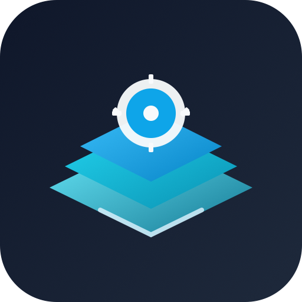

#  Helm Apps Library

<p align="center">
  <a href="https://github.com/alvnukov/helm-apps/actions/workflows/ci.yml">
    
  </a>
  <a href="https://github.com/alvnukov/helm-apps/releases">
    
  </a>
  <a href="tests/contracts/values.yaml">
    
  </a>
  <a href="LICENSE">
    
  </a>
  
  
  
</p>

Библиотека Helm-шаблонов для стандартизированного и предсказуемого деплоя приложений в Kubernetes.

`helm-apps` позволяет описывать приложения только через `values.yaml`: без копирования шаблонов между сервисами, с единым контрактом рендера и единым уровнем качества для всей платформы.

Под капотом библиотека использует helper-паттерны `flant-lib` (`fl.*`) как базовый слой обработки значений и рендера:  
https://github.com/flant/helm-charts/tree/master/.helm/charts/flant-lib

> Библиотека полностью поддерживает `Helm` и совместима с `werf`.  
> Практически `werf` часто удобнее в daily workflow, потому что объединяет рендер и delivery в единый pipeline.  
> При этом весь функционал библиотеки доступен и через чистый `Helm`.

История изменений: [`CHANGELOG.md`](CHANGELOG.md)

## Старт здесь (самый короткий путь)

1. Первый успешный рендер за 10 минут: [`docs/quickstart.md`](docs/quickstart.md)
2. Выбор правильного подхода под задачу: [`docs/decision-guide.md`](docs/decision-guide.md)
3. Точные поля и типы параметров: [`docs/reference-values.md`](docs/reference-values.md)

## Почему это удобно команде

- Единая модель деплоя для всех сервисов: одинаковая структура `values.yaml`.
- Меньше копипаста и ручного YAML: логика централизована в библиотеке.
- Предсказуемость в production: schema + контракты + совместимость Kubernetes в CI.
- Быстрый onboarding: разработчики используют готовые профили через `global._includes` и `_include`.
- Управляемая эволюция: в ветке `1.x` приоритет на стабильность и совместимость.

## Быстрый старт (5-10 минут)

Подробный и линейный onboarding с готовыми шагами: [`docs/quickstart.md`](docs/quickstart.md).

### 1. Подключить dependency

В `.helm/Chart.yaml`:

```yaml
apiVersion: v2
name: my-app
version: 1.0.0
dependencies:
  - name: helm-apps
    version: ~1
    repository: "@helm-apps"
```

### 2. Инициализировать библиотеку

Создать `.helm/templates/init-helm-apps-library.yaml`:

```yaml
{{- include "apps-utils.init-library" $ }}
```

### 3. Обновить зависимости

```bash
helm repo add --force-update helm-apps https://alvnukov.github.io/helm-apps
helm dependency update .helm
```

### 4. Описать приложение в `values.yaml`

```yaml
global:
  env: prod
  ci_url: example.org

apps-stateless:
  api:
    _include: ["apps-stateless-defaultApp"]
    containers:
      main:
        image:
          name: nginx
        ports: |
          - name: http
            containerPort: 80
    service:
      enabled: true
      ports: |
        - name: http
          port: 80

apps-ingresses:
  api:
    _include: ["apps-ingresses-defaultIngress"]
    host: "{{ $.Values.global.ci_url }}"
    paths: |
      - path: /
        pathType: Prefix
        backend:
          service:
            name: api
            port:
              number: 80
    tls:
      enabled: true
```

### 5. Проверить рендер

```bash
helm lint .helm
helm template my-app .helm --set global.env=prod
```

## Ключевые возможности

| Возможность | Что дает | Где смотреть |
|---|---|---|
| `global._includes` + `_include` | Переиспользование профилей, рекурсивный merge map | [README merge section](#example-global-includes-merge) |
| `global.env` + `_default` + regex | Мульти-окружения в одном `values.yaml` | [`docs/reference-values.md#param-global-env`](docs/reference-values.md#param-global-env) |
| Release mode (`global.deploy` + `global.releases`) | Централизованная матрица версий app по `global.env` | [`docs/reference-values.md#param-global-deploy`](docs/reference-values.md#param-global-deploy) |
| Shared env из Secret/ConfigMap | Подключение общих env-блоков в контейнеры | [`docs/cookbook.md#63-порядок-источников-env-sharedenvconfigmapssharedenvsecretsenvfromsecretenvvarsenvvars`](docs/cookbook.md#63-порядок-источников-env-sharedenvconfigmapssharedenvsecretsenvfromsecretenvvarsenvvars) |
| Custom renderer (`__GroupVars__.type`) | Рендер собственных сущностей через цикл библиотеки | [`docs/library-guide.md#param-custom-renderer`](docs/library-guide.md#param-custom-renderer) |
| Контрактная стабильность | Предсказуемость и защита от регрессий | [`docs/stability.md`](docs/stability.md) |

<a id="example-global-includes-merge"></a>
## Ключевая механика: `global._includes` и рекурсивный merge

`global._includes` это библиотека переиспользуемых конфигурационных блоков.  
Приложение подключает блоки через `_include`, после чего библиотека объединяет значения рекурсивно.

Базовый пример:

```yaml
global:
  _includes:
    profile-base:
      replicas: 2
      service:
        enabled: true
        ports: |
          - name: http
            port: 80
      containers:
        main:
          resources:
            requests:
              mcpu: 100
              memoryMb: 128
    profile-prod:
      replicas: 4
      containers:
        main:
          resources:
            limits:
              memoryMb: 512

apps-stateless:
  api:
    _include: ["profile-base", "profile-prod"]
    containers:
      main:
        image:
          name: nginx
```

Что важно:

1. Merge рекурсивный для map-структур.
2. Порядок `_include` важен: следующий профиль может переопределять предыдущий.
3. Локальные поля приложения имеют приоритет над include-профилями.
4. Основной DRY-механизм библиотеки строится именно на `_include`.
5. Native YAML list в values запрещены (кроме `_include` и `_include_files`): для list-полей Kubernetes используйте YAML block string (`|`).

### Примеры merge-поведения

#### Пример 1: Рекурсивный merge map

```yaml
global:
  _includes:
    base:
      service:
        enabled: true
        headless: false
    net:
      service:
        ports: |
          - name: http
            port: 80

apps-stateless:
  api:
    _include: ["base", "net"]
```

Итог для `api.service`:
- `enabled: true`
- `headless: false`
- `ports: ...`

#### Пример 2: Порядок include (последний имеет приоритет)

```yaml
global:
  _includes:
    base:
      replicas: 2
    prod:
      replicas: 5

apps-stateless:
  api:
    _include: ["base", "prod"]
```

Итог: `replicas: 5`.

#### Пример 3: Локальный override сильнее include

```yaml
global:
  _includes:
    base:
      replicas: 2

apps-stateless:
  api:
    _include: ["base"]
    replicas: 3
```

Итог: `replicas: 3`.

#### Пример 4: Env-map merge с `_default` и явным env

```yaml
global:
  _includes:
    base:
      replicas:
        _default: 2
        production: 4
    canary:
      replicas:
        _default: 1
        production: 2

apps-stateless:
  api:
    _include: ["base", "canary"]
```

Итоговое поведение:
- для `production` будет использовано `4` (из `base.production`);
- для остальных env будет `_default: 1` (из `canary._default`).

Практика:
- окружение передавайте через `global.env`;
- всегда проверяйте итоговый рендер в target env (`helm template ... --set global.env=<env>`).

<a id="example-include-concat"></a>
#### Пример 5: `_include`-списки конкатенируются

Если include-профиль сам содержит `_include`, итоговый список объединяется.

```yaml
global:
  _includes:
    profile-a:
      _include: ["base-a"]
      replicas: 2
    profile-b:
      _include: ["base-b"]
      service:
        enabled: true

apps-stateless:
  api:
    _include: ["profile-a", "profile-b"]
```

Итоговый include-chain для `api` объединяет оба списка (`base-a` + `base-b`) и затем применяет локальные поля.

## Release mode (`global.deploy` + `global.releases`)

Опциональный режим для централизованного управления версиями:
- релиз выбирается по `global.env` через `global.deploy.release`;
- матрица версий хранится в `global.releases`;
- app key берется из `versionKey`, а если он не задан — из имени app;
- при `global.deploy.enabled=true` app включается автоматически, когда версия найдена;
- если `image.staticTag` не задан, используется версия из релизной матрицы.

Практический референс и пример: [`docs/reference-values.md#param-global-deploy`](docs/reference-values.md#param-global-deploy)

## Custom renderer: расширение библиотеки своими типами

Библиотека поддерживает пользовательские группы через `__GroupVars__.type`.
Это позволяет рендерить custom-ресурсы в том же цикле, где рендерятся встроенные `apps-*`.

Ключевые моменты:
- в группе задается `__GroupVars__.type: <custom-type>`;
- в chart приложения объявляется `define "<custom-type>.render"`;
- значения приложения доступны в `$.CurrentApp.*`.

Пример и полный контракт контекста:
- [`docs/library-guide.md#param-custom-renderer`](docs/library-guide.md#param-custom-renderer)

## Shared env и приоритеты переменных

Лицевая страница оставляет только общий ориентир: библиотека поддерживает подключение общих `ConfigMap/Secret` и предсказуемый контракт приоритетов переменных.

Детальный технический порядок источников (`sharedEnvConfigMaps`, `sharedEnvSecrets`, `envFrom`, `secretEnvVars`, `envVars`) вынесен в профильные документы:
- [`docs/cookbook.md#63-порядок-источников-env-sharedenvconfigmapssharedenvsecretsenvfromsecretenvvarsenvvars`](docs/cookbook.md#63-порядок-источников-env-sharedenvconfigmapssharedenvsecretsenvfromsecretenvvarsenvvars)
- [`docs/architecture.md#arch-container-env-order`](docs/architecture.md#arch-container-env-order)

## Стабильность и надежность

Текущий фокус: **стабильный production-рендер и контролируемая эволюция**.

Что обеспечивает надежность:
- schema-валидация values: [`tests/.helm/values.schema.json`](tests/.helm/values.schema.json);
- контрактные сценарии: [`tests/contracts/values.yaml`](tests/contracts/values.yaml);
- CI matrix совместимости Kubernetes (legacy + current);
- `kind` + `kubectl apply --dry-run=server` с CRD;
- property-based fuzz проверки контрактов.

Детально: [`docs/stability.md`](docs/stability.md)

## Совместимость

- Helm: полностью поддерживается.
- werf: полностью совместим, часто удобнее как единый delivery workflow.
- Kubernetes: совместимость проверяется в CI по нескольким версиям.

## Карта документации

- Точка входа: [`docs/README.md`](docs/README.md)
- Быстрый путь до первого результата: [`docs/quickstart.md`](docs/quickstart.md)
- Гайд выбора подхода: [`docs/decision-guide.md`](docs/decision-guide.md)
- Концепция и handbook: [`docs/library-guide.md`](docs/library-guide.md)
- Архитектура рендера и приоритеты: [`docs/architecture.md`](docs/architecture.md)
- Полный reference по параметрам: [`docs/reference-values.md`](docs/reference-values.md)
- Индекс параметров (описание + пример): [`docs/parameter-index.md`](docs/parameter-index.md)
- Карта сценариев (задача -> решение): [`docs/use-case-map.md`](docs/use-case-map.md)
- Cookbook с рабочими рецептами: [`docs/cookbook.md`](docs/cookbook.md)
- Operations playbook: [`docs/operations.md`](docs/operations.md)
- FAQ: [`docs/faq.md`](docs/faq.md)
- Глоссарий: [`docs/glossary.md`](docs/glossary.md)
- Модель стабильности: [`docs/stability.md`](docs/stability.md)

Практические артефакты:
- полный пример values: [`tests/.helm/values.yaml`](tests/.helm/values.yaml)
- schema values: [`tests/.helm/values.schema.json`](tests/.helm/values.schema.json)
- контрактный набор сущностей: [`tests/contracts/values.yaml`](tests/contracts/values.yaml)

## Для контрибьюторов

При изменении возможностей библиотеки обновляйте синхронно:

1. шаблоны в `charts/helm-apps/templates`;
2. примеры в `tests/.helm/values.yaml` и/или `tests/contracts/values.yaml`;
3. schema в `tests/.helm/values.schema.json`;
4. документацию в `docs/reference-values.md`, `docs/cookbook.md`, `docs/parameter-index.md`.
